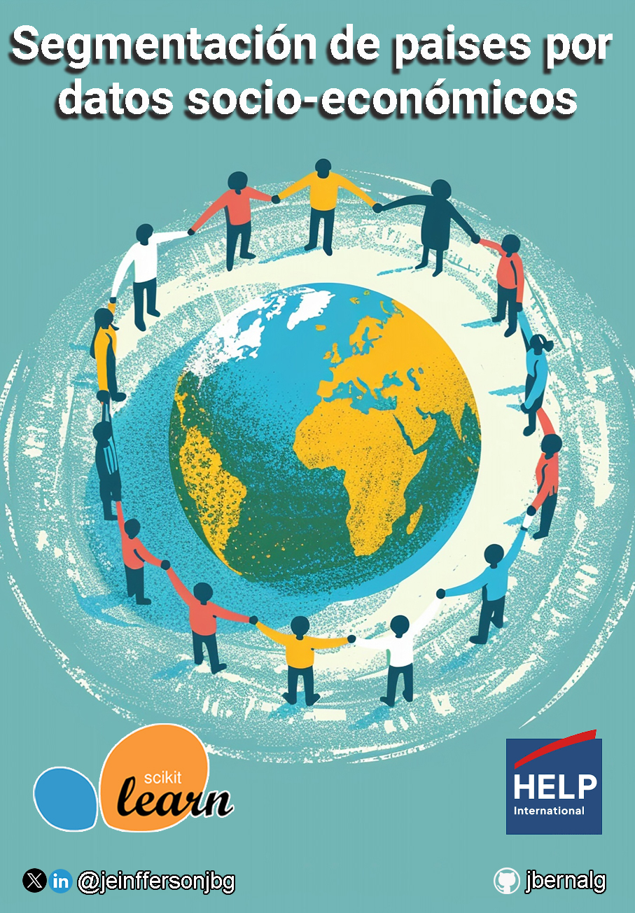
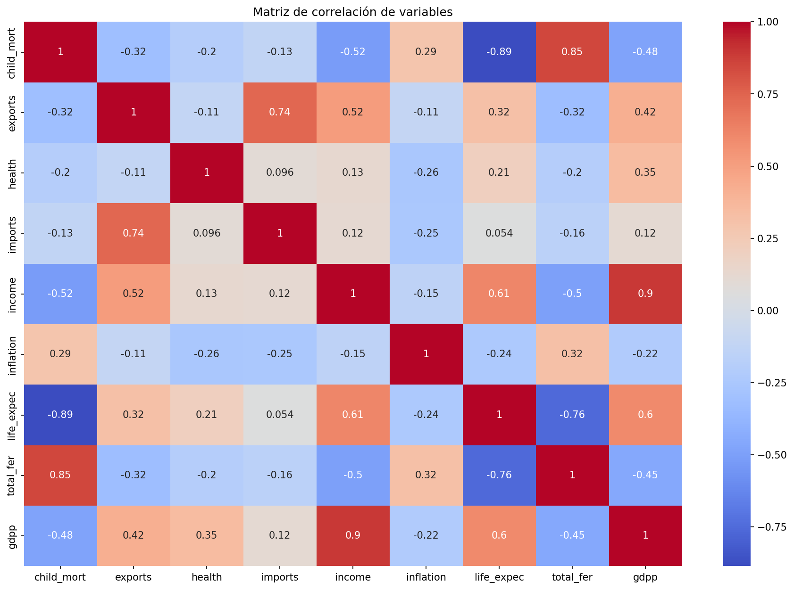
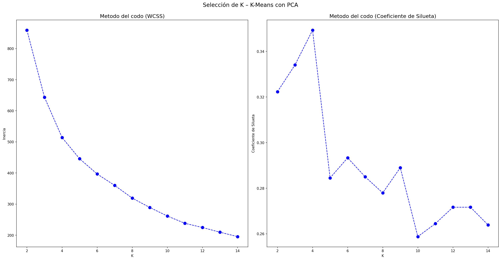
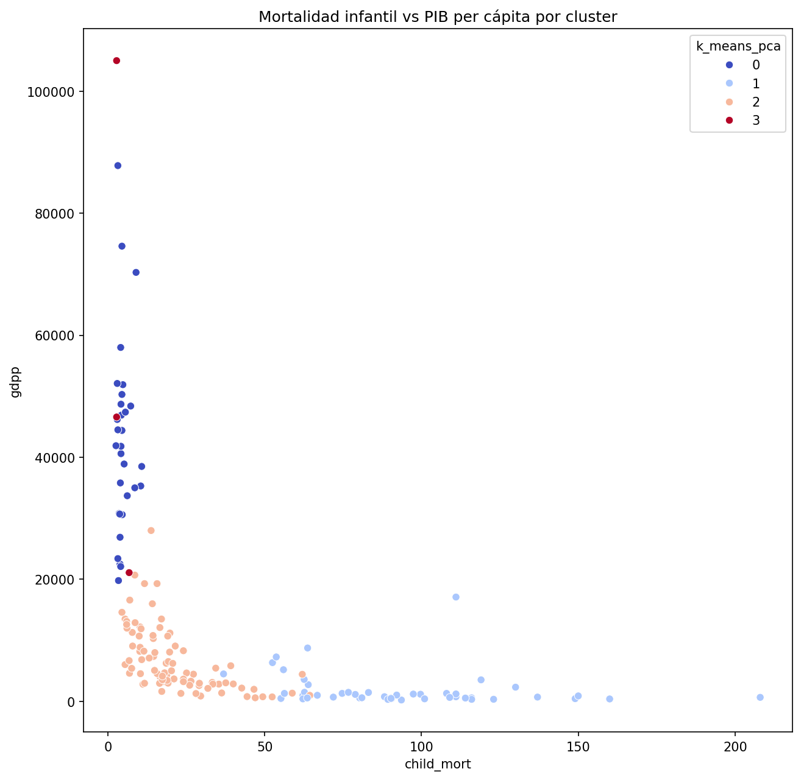
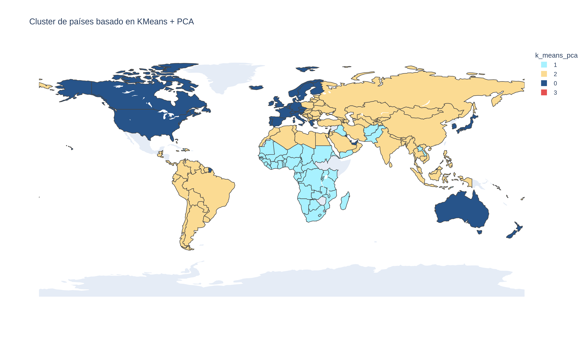

# Segmentación de Países por Datos Socioeconómicos



Proyecto de Machine Learning no supervisado que segmenta 167 países según indicadores socioeconómicos y de salud, con el fin de identificar cuáles requieren mayor prioridad de ayuda humanitaria.

## Acerca del proyecto

**HELP International** es una ONG humanitaria que ha logrado recaudar cerca de **10 millones de dólares** y necesita decidir, de forma estratégica, en qué países invertir ese dinero para maximizar su impacto.

Este proyecto utiliza técnicas de *clustering* sobre el dataset [`Country-data.csv`](data/Country-data.csv) — 167 países con 9 indicadores socioeconómicos y de salud cada uno (mortalidad infantil, exportaciones, importaciones, gasto en salud, ingreso, inflación, esperanza de vida, fertilidad y PIB per cápita) — para agrupar los países según su nivel de desarrollo y así apoyar la toma de decisiones de la organización.

## Objetivo

Segmentar los 167 países del dataset en grupos con características socioeconómicas y de salud similares, aplicando y comparando distintas técnicas de aprendizaje no supervisado (K-Means, Clustering Jerárquico Aglomerativo y DBSCAN, con y sin reducción de dimensionalidad mediante PCA), con el fin de identificar qué países presentan mayor nivel de subdesarrollo y necesidad de ayuda humanitaria.

## Metodología

1. **Análisis exploratorio (EDA):** validación de nulos y duplicados (no se encontraron), análisis de distribución con boxplots y detección de outliers, y matriz de correlación entre variables.
2. **Preprocesamiento:** estandarización de variables con `StandardScaler` para que todas aporten en la misma escala a los modelos de distancia.
3. **Reducción de dimensionalidad:** aplicación de PCA, reduciendo las 9 variables originales a **4 componentes principales** que retienen ~90% de la varianza.
4. **Modelado comparativo:** entrenamiento y evaluación de 3 algoritmos de clustering (**K-Means**, **Clustering Jerárquico Aglomerativo** y **DBSCAN**), cada uno sobre los datos con y sin PCA, seleccionando el número óptimo de grupos mediante el método del codo y el coeficiente de silueta.
5. **Selección del modelo final:** comparación de los índices de silueta de los 6 escenarios evaluados, eligiendo el de mejor desempeño.
6. **Interpretación y visualización:** caracterización de cada cluster y mapeo geográfico de los resultados.

## Resultados

**Comparación de modelos (coeficiente de silueta):**

| Modelo | Con PCA | Sin PCA |
|---|---|---|
| **K-Means** | **0.349** (k=4) | 0.301 (k=5) |
| Jerárquico Aglomerativo | 0.307 (k=2) | 0.315 (k=2) |
| DBSCAN | 0.186 | 0.215 |

El modelo con mejor separación entre grupos fue **K-Means sobre los datos con PCA (k=4)**, el cual fue el elegido para la segmentación final.

### Gráficas más relevantes



**Correlación entre variables.** El ingreso y el PIB per cápita están fuertemente correlacionados de forma positiva, mientras que la mortalidad infantil se correlaciona negativamente con la esperanza de vida y la fertilidad — confirma que los indicadores capturan un mismo eje de desarrollo económico y social.



**Selección del número óptimo de clusters.** El método del codo y el coeficiente de silueta coinciden en que **K = 4** ofrece la mejor segmentación para K-Means sobre los datos con PCA.



**Separación de los clusters.** Al graficar mortalidad infantil vs. PIB per cápita se observa una clara separación entre los 4 grupos, validando visualmente la calidad de la segmentación.



**Mapa mundial de clusters.** Visualización geográfica final: cada país coloreado según el cluster de desarrollo socioeconómico al que pertenece.

## Conclusiones

- El dataset no presentó valores nulos ni duplicados, pero sí variables con escalas muy heterogéneas y outliers, lo que justificó estandarizar los datos antes de aplicar los modelos.
- Reducir la dimensionalidad con PCA (4 componentes, ~90% de varianza explicada) mejoró la calidad de los clusters obtenidos frente a usar todas las variables originales.
- El modelo final (**K-Means + PCA, k=4**) segmentó los países en 4 perfiles claramente diferenciados:
  - **Cluster 0 (31 países) — Alto desarrollo:** ingreso y PIB per cápita elevados (~\$44.700 / \$42.600), mortalidad infantil muy baja (4.9‰). Ej.: EE. UU., Canadá, Australia, Europa Occidental.
  - **Cluster 1 (47 países) — Mayor vulnerabilidad:** ingreso y PIB per cápita muy bajos (~\$3.900 / \$1.900), mortalidad infantil muy alta (93‰). Concentra la mayoría de países de África Subsahariana, además de Haití, Afganistán y Yemen.
  - **Cluster 2 (86 países) — Desarrollo medio:** indicadores intermedios (ingreso ~\$12.800, mortalidad infantil 21.6‰). Es el grupo más numeroso: Latinoamérica, Europa del Este y Asia.
  - **Cluster 3 (3 países) — Economías atípicas:** Luxemburgo, Malta y Singapur; economías de comercio/finanzas con exportaciones e importaciones extremadamente altas como % del PIB y los mayores ingresos del dataset.

## Recomendaciones

- **Priorizar el Cluster 1** para la asignación de los fondos de HELP International, al concentrar los países con mayores carencias económicas, sanitarias y sociales.
- Considerar al **Cluster 2** como una segunda línea de apoyo, enfocando los recursos en los países de ese grupo más cercanos al perfil del Cluster 1.
- Los **Clusters 0 y 3** no requieren ayuda humanitaria, dado su alto nivel de desarrollo económico.
- Como trabajo futuro: enriquecer el dataset con más variables (educación, acceso a agua potable, estabilidad política) y actualizar periódicamente los datos para monitorear la evolución de cada país entre clusters.

## Herramientas utilizadas

- **Python 3.10**
- **Jupyter Notebook**
- `pandas`, `numpy` — manipulación de datos
- `scikit-learn` — `StandardScaler`, `PCA`, `KMeans`, `AgglomerativeClustering`, `DBSCAN`, `silhouette_score`
- `matplotlib`, `seaborn` — visualización estática
- `plotly` + `kaleido` — mapa geográfico interactivo y su exportación a imagen estática
- `pycountry` — conversión de nombres de país a código ISO-3

## Estructura del repositorio

```
Segmentacion_Paises/
├── data/
│   └── Country-data.csv          # Dataset original
├── notebooks/
│   └── Proyecto_countries.ipynb  # Notebook con el análisis completo
├── outputs/
│   └── *.png                     # Gráficos generados por el notebook
├── img/
│   └── segmentacion_paises.jpg   # Imagen de portada
├── requirements.txt               # Librerías y versiones necesarias
└── README.md
```

## Cómo clonarlo

Requiere **Python 3.10+**.

```bash
git clone https://github.com/jbernalg/Segmentacion_Paises.git
cd Segmentacion_Paises

# (Opcional pero recomendado) crear un entorno virtual
python -m venv venv
source venv/bin/activate   # En Windows: venv\Scripts\activate

# Instalar dependencias
pip install -r requirements.txt

# Ejecutar el notebook
jupyter notebook notebooks/Proyecto_countries.ipynb
```

> Ajusta la URL del `git clone` si el nombre del repositorio en tu cuenta de GitHub es distinto.

**Configuraciones adicionales:**
- Al abrir el notebook, selecciona como *kernel* el mismo entorno donde instalaste `requirements.txt`.
- `kaleido` (usado para exportar el mapa a PNG) necesita acceso a internet la primera vez que se ejecuta, tanto para descargar su navegador headless como para obtener los límites geográficos del mapa desde el CDN de Plotly.

## Autor

[<br><sub>Jeinfferson Bernal</sub>](https://github.com/jbernalg)
